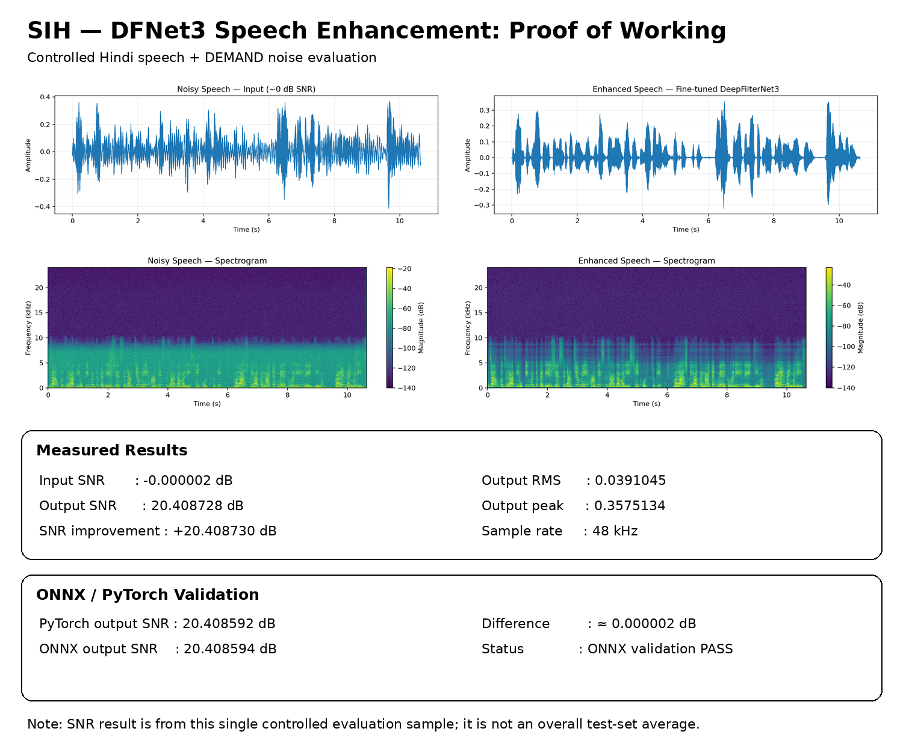

# 🎧 Speech Enhancement Demonstration

This directory contains the demonstration of the fine-tuned DeepFilterNet3 speech enhancement system.

---

## 🔊 Demonstration Pipeline

```text
Clean Speech
     +
DEMAND Noise
     ↓
Approximately 0 dB Input SNR
     ↓
Fine-tuned DeepFilterNet3
     ↓
Enhanced Speech
```

---

## 🧪 Controlled Test

A Hindi speech sample was mixed with DEMAND environmental noise to create a controlled noisy speech signal at approximately **0 dB SNR**.

### Input

```text
Clean Speech + DEMAND Noise
          ↓
     ~0 dB SNR
          ↓
    Noisy Speech
```

### Enhancement

```text
Noisy Speech
     ↓
Fine-tuned DeepFilterNet3
     ↓
Enhanced Speech
```

---

## 📊 Result

| Measurement | Result |
|---|---:|
| Input SNR | ≈ 0 dB |
| Output SNR | **20.4086 dB** |
| SNR Improvement | **≈ +20.4086 dB** |
| Output RMS | 0.0391 |
| Output Peak | 0.3575 |

> **Note:** The 20.4086 dB result is from one controlled evaluation sample and is not the overall test-set average.

---

## 🔬 PyTorch vs ONNX

The same controlled input was processed using the ONNX-backed pipeline.

| Implementation | Output SNR |
|---|---:|
| PyTorch | 20.408592 dB |
| ONNX Runtime | 20.408594 dB |

Difference:

```text
≈ 0.000002 dB
```

This demonstrates that the exported ONNX neural-network components reproduce the PyTorch result extremely closely for this evaluation pipeline.

---

## 🎵 Audio Files

### Input

**Noisy speech at approximately 0 dB SNR**

`noisy_0dB.wav`

### Output

**Enhanced speech from the fine-tuned model**

`enhanced_finetuned.wav`

### ONNX Output

**Enhanced speech using the ONNX-backed pipeline**

`enhanced_onnx_hybrid.wav`

---

## 📈 Visual Comparison

The demonstration will include:

```text
             BEFORE                    AFTER

        Noisy Speech             Enhanced Speech
             │                         │
             ▼                         ▼
          Waveform                  Waveform
             │                         │
             ▼                         ▼
        Spectrogram               Spectrogram
```

The visual comparison allows the input and enhanced signals to be inspected alongside the quantitative measurements.

---
## 🎧 Listen to the Demonstration

### 1. Clean Speech — Reference

[▶️ Download / Listen to Clean Speech](clean.wav)

Reference speech before noise mixing.

---

### 2. Noisy Speech — Approximately 0 dB SNR

[▶️ Download / Listen to Noisy Speech](noisy_0dB.wav)

Hindi speech mixed with DEMAND environmental noise at approximately 0 dB SNR.

---

### 3. Enhanced Speech — Fine-tuned DeepFilterNet3

[▶️ Download / Listen to Enhanced Speech](enhanced_finetuned.wav)

Output produced by the fine-tuned DeepFilterNet3 model.

---

### 🔄 Demonstration Flow

```text
🎤 Clean Speech
       +
🌧️ DEMAND Noise
       ↓
   ≈ 0 dB SNR
       ↓
┌─────────────────────┐
│ Fine-tuned          │
│ DeepFilterNet3      │
└──────────┬──────────┘
           ↓
    Enhanced Speech

And immediately below that, add:

```markdown
## 📈 Visual Results



## 🧠 Model

```text
Model: DeepFilterNet3
Training: Fine-tuned
Final checkpoint: Epoch 120
Sample rate: 48 kHz
FFT size: 960
Hop size: 480
```

---

## 🚀 Deployment Status

```text
DeepFilterNet3 Training       ✅
Controlled Evaluation         ✅
ONNX Export                   ✅
ONNX Validation               ✅
Audio Demonstration           🟡
Raspberry Pi 5 Deployment     🟡
Real-Time Benchmark           🟡
```

The Raspberry Pi 5 stage is the next hardware-validation stage. No Raspberry Pi performance numbers are claimed until the system is tested on actual hardware.

---

## 🎥 Technical Demonstration

A short technical demonstration video will be added here showing:

1. Noisy speech input
2. DeepFilterNet3 processing
3. Enhanced speech output
4. Waveform/spectrogram comparison
5. Quantitative results
6. ONNX validation
7. Raspberry Pi 5 deployment architecture

**Video:** Coming soon
